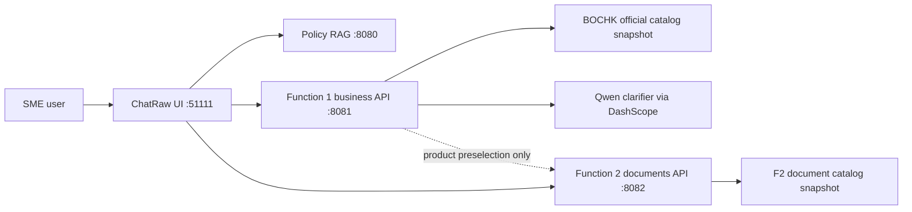

# CrossBridge AI Function 1 and Function 2 Workflow

## Function 1: Loan Matching

1. The user enters loan-matching mode from the sidebar, the composer mode switch, or an in-chat CTA.
2. ChatRaw creates or resumes an open F1 session through the 8081 business service. The current Settings language is used for the first visible question.
3. F1 collects four required fields: cross-border scenario, annual turnover, financing purpose, and requested amount.
4. Enum chips update the draft deterministically. Free-text answers are sent to the Qwen clarifier when a DashScope key is configured; numeric answers also have a deterministic parser.
5. Clear Chinese or English free-text answers switch subsequent clarification questions to the user's language. Product codes and numeric-only replies retain the most recent clear language.
6. Once the required profile is complete, F1 runs deterministic rules against the BOCHK official-source catalog and shows candidate product cards in the chat transcript.
7. The user can edit the draft, rerun matching, save the confirmed SME profile, discard the session, or click `Prepare Documents` on a product card.

Data boundary: F1 owns its FastAPI service on 8081, SQLite database, Alembic migrations, session drafts, saved SME profiles, matching results, audit events, official catalog snapshot, and deterministic matching rules.

## Function 2: Document Preparation

1. The user enters from the sidebar or clicks `Prepare Documents` on an F1 product card.
2. F1-to-F2 handoff passes only product preselection and optional context for recommendation highlighting. The user still chooses the import or export scenario inside F2.
3. ChatRaw opens the F2 workbench as a right-side panel while preserving the chat transcript.
4. The 8082 service creates or restores a document package for the SME and selected scenario.
5. The panel combines the scenario base checklist with the selected product overlay. Publicly documented materials are labelled as public-source requirements; preparation suggestions remain suggestions; unpublished requirements remain relationship-manager confirmation items.
6. The user checks items, edits the scenario-specific transaction form and financing cover sheet, reviews non-blocking validation warnings, switches compatible products, resets the package, or prints the preparation pack.
7. Template drafts and checklist state auto-save. Switching products keeps base checklist progress and restores product-overlay progress when switching back.

Data boundary: F2 owns its FastAPI service on 8082, separate SQLite database, separate Alembic environment, read-only document catalog snapshot, package state, template drafts, checklist states, and audit events. It never reads or writes F1 database tables.

## Service Flow

