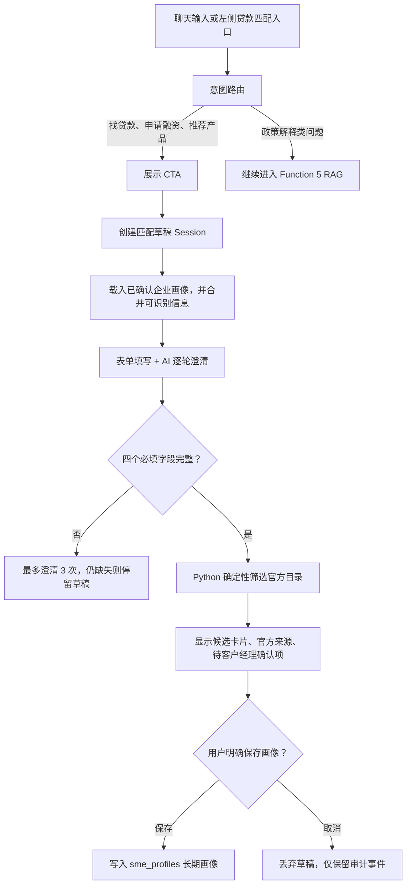
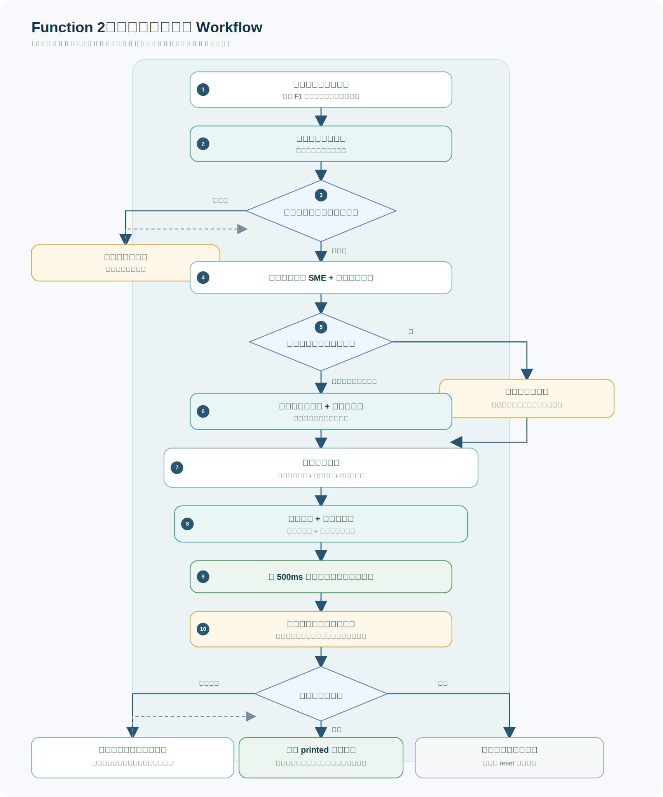
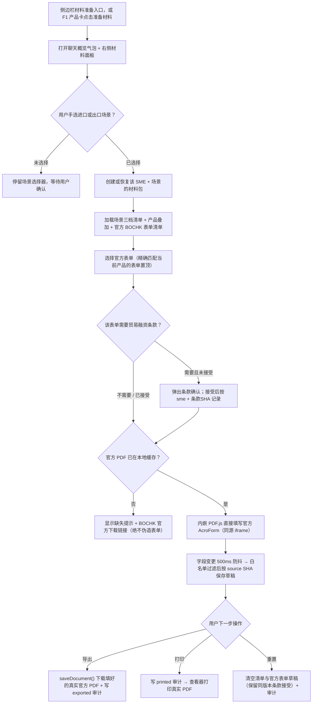
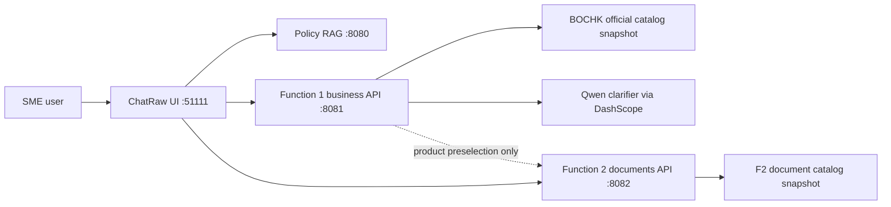

# CrossBridge AI Function 1 and Function 2 Workflow

## Function 1: Loan Matching

The four required fields are cross-border scenario, annual turnover, financing purpose, and requested amount. Enum chips update the draft deterministically. Free-text answers use the Qwen clarifier when configured, and visible clarification questions follow the user's Chinese or English input language.

Data boundary: F1 owns its FastAPI service on 8081, SQLite database, Alembic migrations, session drafts, saved SME profiles, matching results, audit events, official catalog snapshot, and deterministic matching rules.

## Function 2: Document Preparation

F1-to-F2 handoff passes only product preselection and optional context for recommendation highlighting. The user still chooses the import or export scenario inside F2. Document preparation fills **genuine official BOCHK PDF forms** in-place via PDF.js (ENABLE_FORMS + `annotationStorage`, exported with `saveDocument()` — no flattening, no coordinate overlays), instead of self-made fill-in templates. Trade-finance forms are gated behind explicit acceptance of BOCHK's terms; an official PDF that is not present in the deployment's local cache shows a download hint rather than a fabricated form. Publicly documented materials remain public-source labelled; unpublished requirements remain relationship-manager confirmation items.

Data boundary: F2 owns its FastAPI service on 8082, separate SQLite database, separate Alembic environment, read-only document catalog snapshot, the official-form registry, package state, official-form drafts (keyed by `package_id + form_id + source_sha256`), trade-terms acceptance (keyed by `sme_id + terms_sha256`), checklist states, and audit events. It never reads or writes F1 database tables. The encrypted official PDFs live only in a git-ignored local cache (`data/document_preparation/official_forms_cache/`); they are never committed.

## Service Flow

