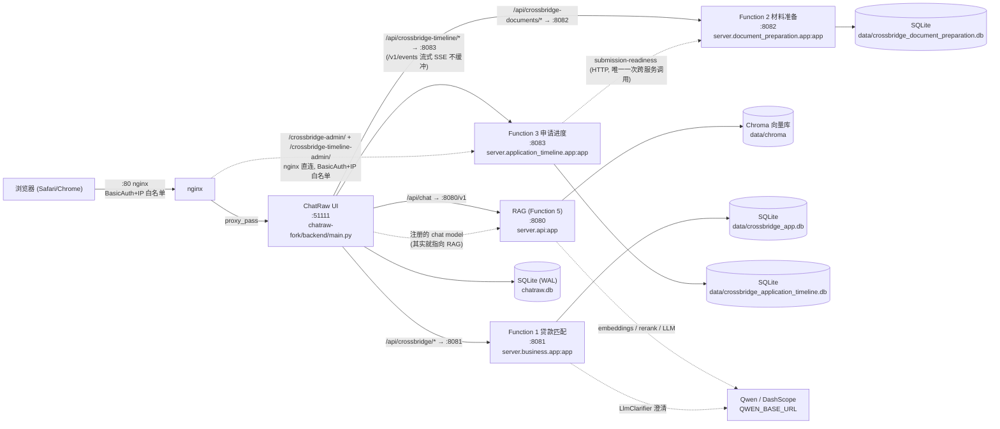

# Service Architecture — CrossBridge AI

CrossBridge AI 不是单体应用，而是 **五个独立进程**，各自单独启动、各有端口、各有数据库。浏览器只跟 ChatRaw UI 服务通信，由它反向代理其余服务。本文说明：模块如何拆分、端口分配、数据库隔离、前端如何调后端，以及 RAG / 贷款匹配 / 材料准备 / 申请进度 之间如何通信。

---

## 1. 拓扑总览

**关键边界**：服务之间几乎**不直接互相调用**——唯一的例外是 **F3 提交申请时通过 HTTP 向 F2 查 submission-readiness**（F2 是材料是否就绪的唯一事实来源）。其余所有跨服务编排由 **ChatRaw UI 服务的代理层** + **前端 `app.js` 的状态机**完成。RAG / F1 / F2 / F3 各自只认自己的数据库，互不读写对方的库。

---

## 2. 服务清单（端口 / 入口 / 职责）

| 服务 | 入口 | 端口 | 职责 | systemd 单元 |
|---|---|---|---|---|
| **RAG（Function 5）** | `server.api:app` | 8080 | 把 `files/rag_engine.py` 包成 OpenAI 兼容的 `/v1/chat/completions`。政策问答。 | `crossbridge-fastapi` |
| **Function 1 贷款匹配** | `server.business.app:app` | 8081 | 企业画像草稿 → 对 BOCHK 官方目录做确定性匹配。独立 SQLite + Alembic。 | `crossbridge-business` |
| **Function 2 材料准备** | `server.document_preparation.app:app` | 8082 | 场景清单 + 内嵌 PDF.js 填写真实 BOCHK 官方 PDF 表单。**独立** SQLite + Alembic。 | `crossbridge-documents` |
| **Function 3 申请进度** | `server.application_timeline.app:app` | 8083 | F2 就绪后「提交申请」→ 6 个固定节点的进度时间线；银行端隐藏后台推进节点，SME 端 SSE 实时看进度。**独立** SQLite + Alembic。 | `crossbridge-timeline` |
| **ChatRaw UI** | `chatraw-fork/backend/main.py` | 51111 | 静态前端 + 反向代理。serve `chatraw-fork/backend/static/`。 | `crossbridge-chatraw` |
| **Deploy Console** | `server/deploy_console/app.py` | 8090 | 一键部署控制台（`/deploy/`）：拉 main + 同步 + 重启 + 健康检查。 | `crossbridge-deploy` |

- 监听全部为 `127.0.0.1`（仅 :51111 对内，由 nginx :80 暴露）。F3 的隐藏后台（`/crossbridge-admin/timeline` + `/crossbridge-timeline-admin/v1`）由 nginx 直连 :8083、绕过 ChatRaw，仅靠 nginx 的 BasicAuth + IP 白名单保护（demo 版无 RBAC）。
- ChatRaw 是 `massif-01/ChatRaw`（MIT）的**独立 clone**，通过 `patches/chatraw-function1-function2.patch` 定制，**不嵌入本仓库**。

---

## 3. 数据库隔离

每个服务一套独立存储，**绝不共享**。隔离通过「不同默认文件名 + 不同环境变量覆盖键」保证（见 `server/document_preparation/db.py` 的注释：env key 故意与 F1 区分，"so the two services never share a DB"）。

| 服务 | 存储 | 默认位置 | 覆盖环境变量 | 迁移配置 |
|---|---|---|---|---|
| ChatRaw UI | SQLite (WAL) | `chatraw-fork/backend/<DATA_DIR>/chatraw.db` | — | 无 Alembic（建表在 `Database.init_db`） |
| Function 1 | SQLite | `data/crossbridge_app.db` | `CROSSBRIDGE_APP_DATABASE_URL` | 根 `alembic.ini` → `migrations/`（head `20260602_0008`） |
| Function 2 | SQLite | `data/crossbridge_document_preparation.db` | `CROSSBRIDGE_DOCUMENTS_DATABASE_URL` | `server/document_preparation/alembic.ini` → `migrations/` |
| Function 3 | SQLite | `data/crossbridge_application_timeline.db` | `CROSSBRIDGE_TIMELINE_DATABASE_URL` | `server/application_timeline/alembic.ini` → `migrations/` |
| RAG | Chroma 向量库 + chunks | `data/chroma`、`data/processed/chunks.jsonl` | — | 无 SQL DB |

- **chatraw.db** 存：chats、messages、settings、注册的 models、plugins、context compaction。
- **crossbridge_app.db**（F1）表：`sme_profiles`、`matching_sessions`、`loan_products`、`match_results`、`saved_drafts`、`audit_events`。
- **crossbridge_document_preparation.db**（F2）核心表：`document_packages`（含 `selected_product_id`、`origin_matching_session_id`）。
- **crossbridge_application_timeline.db**（F3）表：`timeline_applications`（`origin_package_id` **唯一** → 一个 F2 package 幂等一条申请）、`timeline_nodes`（6 个固定节点 + `internal_note` **永不序列化给 SME**）、`timeline_audit_events`。
- **F1/F2/F3 启动即跑迁移**：`create_app(migrate_on_startup=True)`（默认）在 lifespan 里 `alembic upgrade head`；F1 还会把 `data/official_products/bochk_products_latest.json` upsert 进库（`seed_catalog_products`）。所以**重启 business/documents/timeline 服务 = 自动套用新迁移**（F1 顺带 reseed 目录）。
- RAG 没有关系库；它要用的「chat model 配置」存在 **chatraw.db** 里（通过 `POST /api/models` 注册）。

---

## 4. 前端如何调后端（代理层）

浏览器永远只打 `:51111`（经 nginx :80）。`chatraw-fork/backend/main.py` 是唯一的对外门面，按前缀分发：

| 前端请求 | 代理函数 | 转发目标 |
|---|---|---|
| `POST /api/chat` | 内置 chat handler | 调 chatraw.db 里注册的 chat model（= RAG `:8080/v1/chat/completions`），流式或非流式按 Settings。 |
| `/api/crossbridge/{path}` | `proxy_crossbridge_business_api` | `CROSSBRIDGE_BUSINESS_API_URL`（默认 `http://127.0.0.1:8081`）→ `:8081/crossbridge/{path}` |
| `/api/crossbridge-documents/{path}` | `proxy_crossbridge_documents_api` | `CROSSBRIDGE_DOCUMENTS_API_URL`（默认 `http://127.0.0.1:8082`）→ `:8082/crossbridge-documents/{path}` |
| `/api/crossbridge-timeline/{path}` | `proxy_crossbridge_timeline_api` | `CROSSBRIDGE_TIMELINE_API_URL`（默认 `http://127.0.0.1:8083`）→ `:8083/crossbridge-timeline/{path}`（普通读写，缓冲） |
| `/api/crossbridge-timeline/v1/events` | `proxy_crossbridge_timeline_events` | **流式**转发 F3 SSE（`async for chunk … yield`），响应头 `X-Accel-Buffering: no` 让 nginx 也不缓冲。**必须注册在上面的 catch-all 之前**，否则被吞掉缓冲。 |
| `/api/chats`、`/api/models`、`/api/settings`、`/api/plugins`… | chatraw 自身 | chatraw.db |

**两条健壮性约定（曾反复踩坑）**：
- 两个 crossbridge 代理共用一个 aiohttp keep-alive 会话，`_proxy_pass` 对「陈旧连接断开」**重试一次** —— 上游（business/documents）重启后连接池里的死连接不会冒泡成用户可见的 502。
- 前端取数统一走 `app.js` 的 `cbFetchJson`：**先判 `res.ok` 再 `res.json()`**，遇到非 JSON 错误页（nginx 502/401 HTML）时给出可读的 `HTTP <status> · <endpoint>` toast，而不是 WebKit 的 "The string did not match the expected pattern."。

前端是 `chatraw-fork/backend/static/{app.js (Alpine.js), index.html, styles.css}` 单文件应用。静态资源用 `?v=cbdevNN` 做缓存破坏（index.html 内 5 处），**每次改静态必须 bump**，否则浏览器拿旧文件。

---

## 5. 各功能内部 & 之间如何通信

### RAG（政策问答，Function 5）
- 前端「Policy Q&A」模式下发消息 → `POST /api/chat` → 代理到 RAG `:8080/v1`。
- RAG（`files/rag_engine.py`）是一条 LangGraph 链：classify → multi-query → BM25(`bm25_index.py`,jieba)+Dense(Qwen embeddings) → RRF → cross-encoder rerank(`reranker.py`, DashScope gte-rerank-v2, 带降级) → metadata score → **citation gating（`trust_tier × document_type`）** → prompt → LLM。
- 对外只依赖 Qwen/DashScope（`QWEN_BASE_URL`/`DASHSCOPE_API_KEY`）。

### Function 1 贷款匹配
- **意图路由**：前端每条 policy 消息会顺带 `POST /api/crossbridge/v1/loan-matching/route-intent`。`route_intent()`（**纯正则**，无 LLM）判 action / informational / ambiguous，决定是否弹「Start Loan Matching」CTA，并附 `extract_prefill()` 抽到的画像。
- **会话生命周期**：`draft → awaiting_clarification → ready_to_match → matched|saved|discarded`。创建 session **每次都是全新空白草稿**，并把旧的 open session 标记 discarded（重进不复活旧状态）。
- **填槽**：`extract_prefill()` 确定性抽取（场景/用途/金额/营业额）先 seed；缺失槽位才交给 `LlmClarifier`（Qwen，key 取 `CROSSBRIDGE_CLARIFIER_API_KEY`，回退 `DASHSCOPE_API_KEY`）。没有 key 也能跑（靠确定性抽取 + 选项 chip）。
- **匹配**：`match_products()` 对 `scenarios_json/purposes_json/amount/turnover` 做硬 AND 过滤，命中即 score=100（不排序）。
- **多草稿**：`save-draft` 往 `saved_drafts` 写一行（可保存多份，各带所选产品），区别于旧的单行 `sme_profiles`。

### Function 2 材料准备
- 独立 FastAPI + 独立库。`DocumentPackage` 用 `selected_product_id` + `origin_matching_session_id` 记录来源。
- 官方 BOCHK PDF 表单在内嵌 PDF.js viewer 里填写；PDF 文件 **git 忽略**，由 `scripts/fetch_official_forms.py --accept-bochk-trade-terms` 在主机抓到本地缓存（缓存缺失 → 前端显示官方下载提示，绝不伪造）。

### F1 → F2 的衔接（唯一的"跨功能"链路）
候选卡上点 **"Prepare Documents"** → 前端 `openDocumentPreparation(productId, matchingSessionId)` → 选好场景后 `POST /api/crossbridge-documents/v1/packages`，body 带 `selected_product_id` + `origin_matching_session_id`。
**注意**：F1 与 F2 是**两个独立数据库**，这个关联是 F2 库里的**软引用字符串**（无跨库外键）。F1 不知道 F2，F2 也不回写 F1。前端 `app.js` 负责把"哪个产品、来自哪次匹配"传过去。

### Function 3 申请进度时间线
- 独立 FastAPI + 独立库。每条申请固定 6 个节点：`submitted / material_review / credit_assessment / approval_result / signing / disbursement`；新申请初始化 `submitted=completed`、`material_review=in_progress`，其余 `pending`。
- **SME 端**（经 ChatRaw 代理，`/api/crossbridge-timeline/v1/...`）：`POST applications` 提交、`GET applications[/{id}]` 看进度、`GET events` 订阅 SSE。序列化**严格剔除 `internal_note`**。
- **银行端**（nginx 直连 :8083，不经 ChatRaw）：`/crossbridge-admin/timeline`（F3 自托管的单页后台 HTML）+ `/crossbridge-timeline-admin/v1`（推进节点/双语客户说明/内部备注/重置）。**拒绝跳级**（只能动当前节点）；`rejected`/`supplement_required` 强制要求中英文客户说明非空；完成自动推进下一节点。
- **SSE 以 DB 为事实来源**：F3 的 `/events` 每 ~2s 轮询该 SME 的申请、对比 `updated_at`，只推 `{application_id, updated_at}`；前端收到后**重新拉详情**（杜绝内部备注泄漏），断线重连后全量重拉。任何后台写都会 bump `application.updated_at`，所以 SME 端无需刷新即更新。

### F2 → F3 的衔接（唯一的服务间 HTTP 调用）
F2 工作台点 **"提交申请"** → 前端先 flush 草稿 → 调 F2 `GET /packages/{id}/submission-readiness`（材料是否就绪的**唯一事实来源**，规则从前端 `runDocValidation` 1:1 迁到后端）→ 就绪才 `POST /api/crossbridge-timeline/v1/applications`。F3 服务端**再调一次 F2 readiness**做强校验（`readiness_checker` 注入，默认 httpx 打 `CROSSBRIDGE_DOCUMENTS_API_URL`；未就绪→422，F2 不可达→503）。`origin_package_id` 唯一 → 同一 package 二次提交返回原申请（幂等）。

### F1 ↔ RAG
不互相调用。前端按模式编排：Policy Q&A 模式 → `/api/chat`（RAG）；Loan Matching 模式 → `/api/crossbridge/...`（F1 clarify）。`route_intent` 只决定"要不要在政策问答里弹 CTA"。

---

## 6. 典型请求流（端到端）

**A. 政策问答**：输入框（Policy 模式）→ `sendMessage` → `POST /api/chat` →（chatraw 内置 handler）→ RAG `:8080/v1` 流式返回 → 前端渲染；同时 `route-intent` 决定是否追加 CTA 卡。

**B. 贷款匹配一轮**：进入 Loan 模式后输入 → `handleLoanChatTurn` → `POST /api/crossbridge/v1/loan-matching/sessions/{id}/clarify` →（代理）→ F1 :8081 → 返回更新后的 draft → 必填齐 → `/match` → 候选卡。

**C. 准备材料**：候选卡 "Prepare Documents" → `POST /api/crossbridge-documents/v1/packages` →（代理）→ F2 :8082 → 返回清单 + 官方表单 → PDF.js viewer 填写。

**D. 提交申请 + 实时进度**：F2 页脚 "提交申请" → flush 草稿 → `GET .../submission-readiness`（F2）→ 就绪则 `POST /api/crossbridge-timeline/v1/applications`（代理→F3，F3 再校验 F2 readiness）→ 右侧切到时间线面板 + 聊天插概览卡，并开 `EventSource('/api/crossbridge-timeline/v1/events')`（ChatRaw 流式透传）。银行操作员在 `/crossbridge-admin/timeline` 推进节点 → F3 bump `updated_at` → ~2s 内 SSE 推事件 → 前端重拉详情 → SME 端**无刷新**点亮新节点。

---

## 7. 端口 & 环境变量速查

| 端口 | 服务 | 监听 |
|---|---|---|
| 80 | nginx（BasicAuth + IP 白名单） | 0.0.0.0 |
| 51111 | ChatRaw UI（前端 + 代理） | 0.0.0.0 |
| 8080 | RAG | 127.0.0.1 |
| 8081 | Function 1 贷款匹配 | 127.0.0.1 |
| 8082 | Function 2 材料准备 | 127.0.0.1 |
| 8083 | Function 3 申请进度 | 127.0.0.1 |

| 环境变量 | 用途 |
|---|---|
| `DASHSCOPE_API_KEY` / `QWEN_BASE_URL` / `QWEN_MODEL` | RAG/F1/chat 调 Qw/DashScope |
| `CROSSBRIDGE_CLARIFIER_API_KEY` | F1 澄清器专用 key（缺省回退 `DASHSCOPE_API_KEY`） |
| `CROSSBRIDGE_CATALOG_MODE=official` | F1 启用官方目录 seed |
| `CROSSBRIDGE_APP_DATABASE_URL` | 覆盖 F1 DB |
| `CROSSBRIDGE_DOCUMENTS_DATABASE_URL` | 覆盖 F2 DB（与 F1 区分，防共库） |
| `CROSSBRIDGE_TIMELINE_DATABASE_URL` | 覆盖 F3 DB（与 F1/F2 区分，防共库） |
| `CROSSBRIDGE_BUSINESS_API_URL` / `CROSSBRIDGE_DOCUMENTS_API_URL` / `CROSSBRIDGE_TIMELINE_API_URL` | 代理转发目标（默认 8081/8082/8083） |

生产密钥放 `/opt/crossbridge/.env`，不提交 git。

---

## 8. 为什么这样拆

- **故障隔离 + 独立部署**：重启 F1 不影响 RAG/F2/聊天；F1/F2 重启即套迁移、F1 顺带 reseed 目录。
- **数据库分离**：不同 schema、不同迁移历史、不同生命周期（聊天记录 vs 业务草稿 vs 文档包 vs 申请时间线 vs 向量库），互不污染；rsync 部署时 `data/` 下的运行时 DB 不能被 `--delete`。
- **代理层做唯一门面**：前端只认 `/api/*`，跨服务编排集中在 `main.py` 代理 + `app.js` 状态机，单个后端可独立替换（如把 RAG 指到别的 OpenAI 兼容端点）。

> 部署细节（server-update.sh、systemd 重启、nginx 鉴权）见 `deployment.md`；各功能 workflow 见 `function-workflow.md`。
